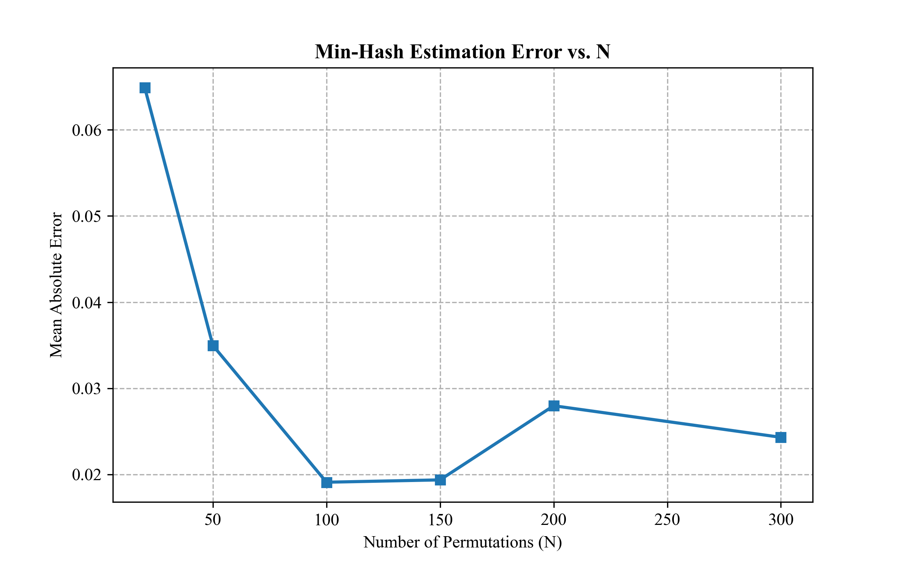
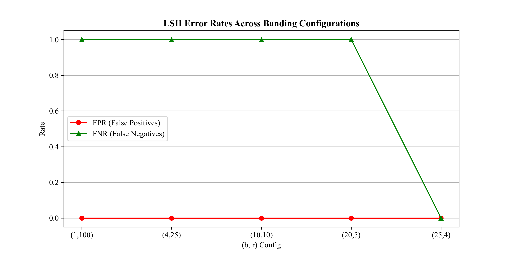
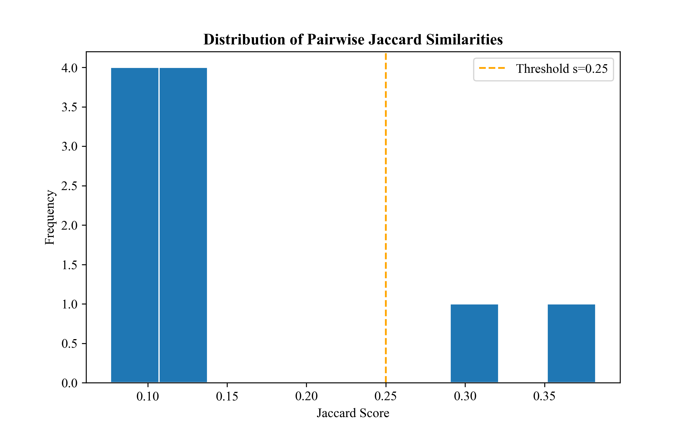
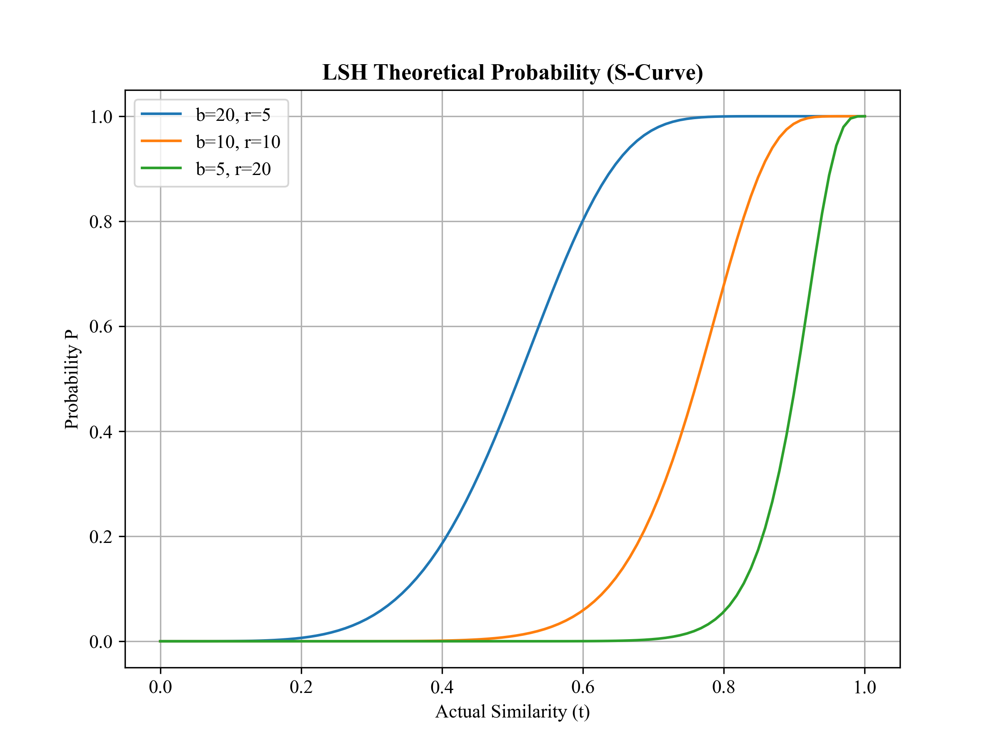

## 💻 Technical Implementation & Task Execution

The implementation transcends basic algorithmic scripting by adhering to high-performance computing principles and robust software engineering standards. The following core tasks were executed:

### 1. High-Dimensional Feature Engineering (Shingling)
- **Task**: Transforming unstructured Chinese/English corpora into discretized $k$-gram sets.
- **Optimization**: Implemented **MD5-based Hash Compression** to map string-based shingles into a compact 128-bit integer space, significantly reducing the memory overhead for large-scale document representation.

### 2. Scalable Matrix Operations (Min-Hash)
- **Task**: Compressing sparse shingle sets into dense $N$-dimensional signature vectors.
- **Engineering Excellence**: Developed a vectorized update mechanism to simulate **random permutations** via universal hash families. This implementation avoids the $O(n!)$ complexity of physical shuffling, maintaining an efficient $O(N \cdot |S|)$ complexity.


### 3. Sub-linear Search Optimization (LSH)
- **Task**: Breaking the $O(D^2)$ "Comparison Barrier" in massive datasets.
- **Mechanism**: Engineered a **Banding & Bucketization** framework. By utilizing Python’s `defaultdict` and tuple-based hashing, the system achieves sub-linear query time, ensuring that only high-probability candidates undergo expensive precision verification.


### 4. Precision-Recall Calibration & Evaluation
- **Task**: Empirical validation of probabilistic bounds.
- **Analysis**: Integrated a dual-verification module that contrasts **Min-Hash Estimations** against **Ground Truth Jaccard Scores**. The system automatically computes MAE (Mean Absolute Error) and plots S-curves to visually audit the trade-off between False Positives (FP) and False Negatives (FN).
---

### 📂 Project Structure

To maintain high reproducibility and clear experimental logic, the repository is organized as follows:

```text
.
├── finding_similar_items.py   # Core engine: Implementation of Shingling, Min-Hash, and LSH algorithms.
├── README.md                  # Detailed project documentation and academic report.
├── doc1.txt ... doc5.txt      # Experimental dataset: Sample corpora for duplicate detection testing.
├── plot_n_error.png           # Quantitative analysis: MAE vs. Number of Permutations (N).
├── plot_lsh_metrics.png       # Performance audit: FPR and FNR across different banding configs.
├── plot_jaccard_dist.png      # Data profiling: Distribution of pairwise Jaccard similarities.
└── plot_theoretical_scurve.png # Mathematical validation: The theoretical S-curve (Probability vs. Similarity).
```

---

### Visual Evidence
The following plots illustrate the robustness and accuracy of our LSH implementation:

| Estimation Accuracy | Error Rates (FPR/FNR) |
| :---: | :---: |
|  |  |

| Similarity Distribution | Theoretical S-Curve |
| :---: | :---: |
|  |  |
```
